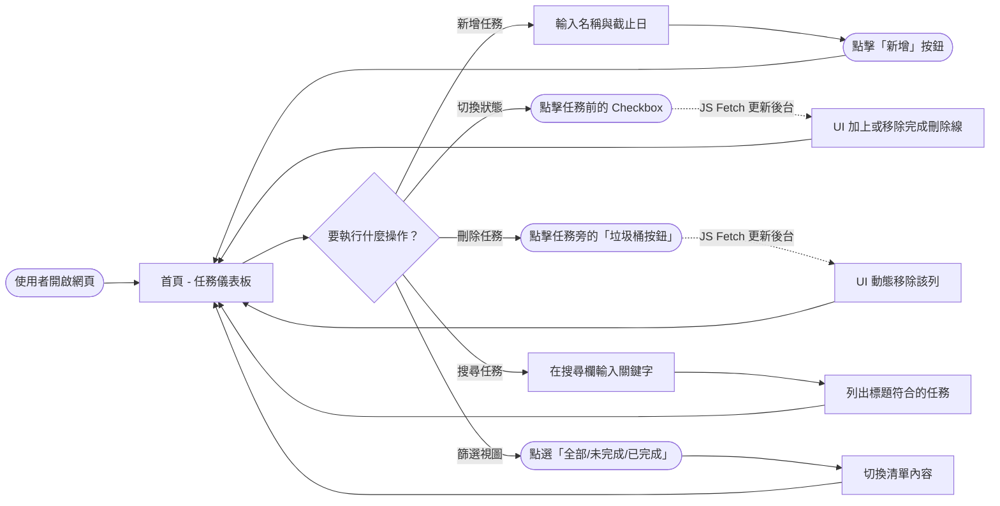
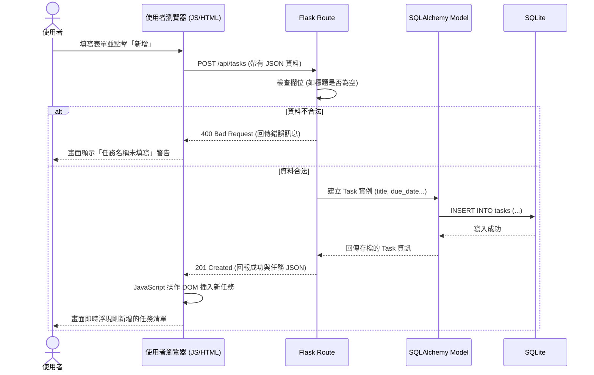

# 系統與使用者流程圖 (Flowchart)：任務管理系統

## 1. 使用者流程圖 (User Flow)

這張圖展示了使用者進入系統後，所能進行的所有操作。為確保互動流暢（參考我們在架構設計中決定使用 JS Vanilla 輔助），許多操作（如打勾完成、刪除）將在畫面上立即回饋，不須重新載入整個頁面。

---

## 2. 系統序列圖 (Sequence Diagram)

以下以「**使用者新增任務**」這個較完整的操作為例，展示前端瀏覽器、Flask 路由、SQLAlchemy Model 與 SQLite 資料庫之間的資料流向。

---

## 3. 功能清單與路由對照表

以下表格定義了主要功能會對應到的後端路由 (URL Paths) 與 HTTP Methods。

| 系統功能 | HTTP 方法 | URL 路徑 | 功能說明 | 前置動作 (觸發條件) |
| --- | --- | --- | --- | --- |
| 初始載入 | GET | `/` | 由 Jinja2 渲染完整的 HTML 首頁，包含目前的任務與統計進度。 | 首次進入網站 或 畫面重整 |
| 新增任務 | POST | `/api/tasks` | 接收表單資料，並存入資料庫。 | 點擊新增按鈕送出 |
| 切換完成狀態 | PATCH | `/api/tasks/<id>/status` | 根據任務 `<id>`，將其設定為已完成或未完成狀態。 | 點擊 Checkbox |
| 刪除指定任務 | DELETE | `/api/tasks/<id>` | 根據任務 `<id>`，從資料庫中刪除該筆資料。 | 點擊刪除按鈕 |
| 篩選任務列表 | GET | `/api/tasks?status=...&q=...` | (可選)若資料龐大時交由後端篩選，回傳符合條件的資料；若資料少也可由前端原生 JS 隱藏。 | 輸入文字或切換頁籤 |

備註：利用 `/api/` 作為前綴能清楚區分「回傳靜態 HTML」與「回傳 JSON 供 JS 非同步操作」的路由職責。
